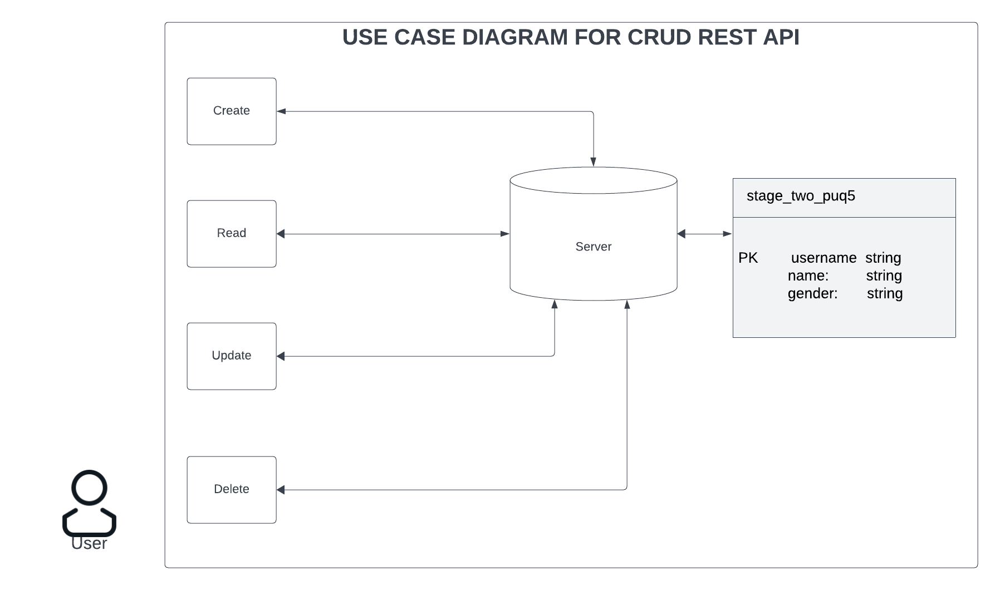
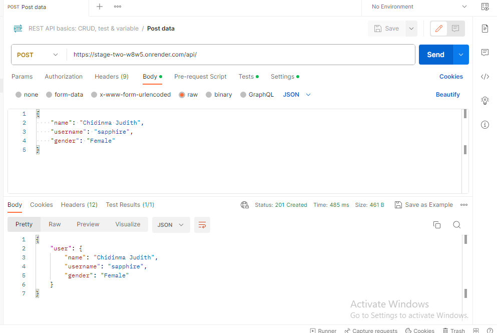
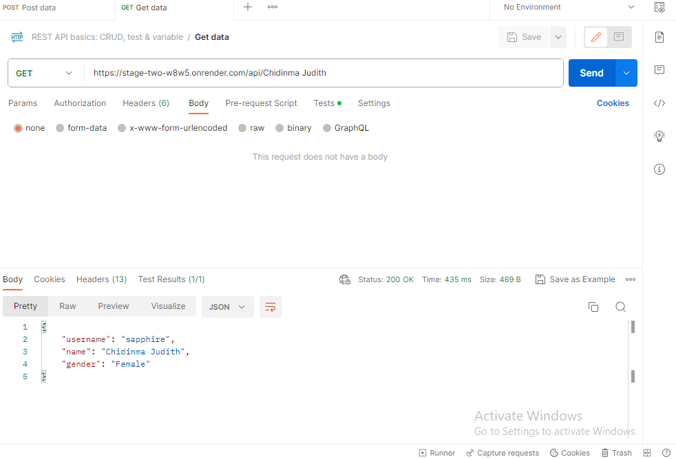
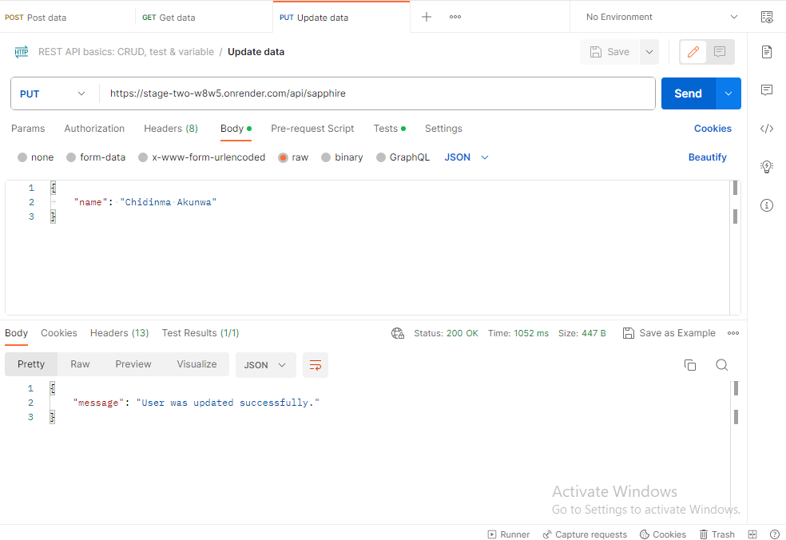
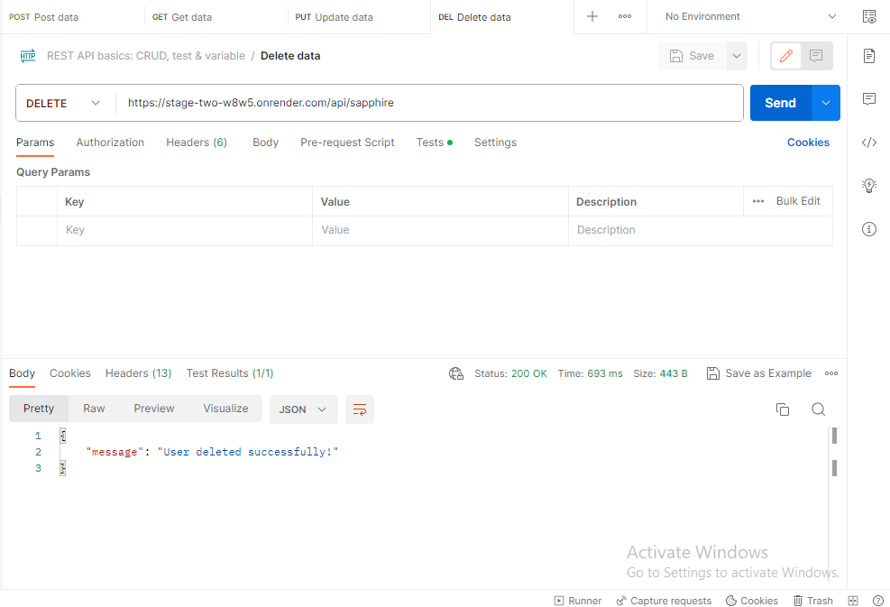

# HNGx_stage-two
## Live Endpoint at https://stage-two-w8w5.onrender.com/api

### Task:
Develop a REST API with Basic CRUD Operation
### Objective
 Build a simple REST API capable of CRUD operations on a resource, say, a "person". The chosen programming language should interface with any chosen database of your choice
#### REST API Development
 Develop an API with endpoints for:
<ol>
<li>CREATE: Adding a new person.</li>
<li>READ: Fetching details of a person.</li>
<li>UPDATE: Modifying details of an existing person</li>
<li>DELETE: Removing a person.</li>
<li>Ensure all interactions with the database are secure and free from common vulnerabilities (e.g., SQL injections).</li>
</ol>

## Project Setup
#### Clone the repository 
```
git clone https://github.com/sa-pphire/hng_stage-two
```
#### Install all dependencies
```
npm install
```
## Run Project
```
node app.js
```
## Use Case Diagram



## API Testing
The following table shows overview of the Rest APIs that will be exported:

- GET     `api/:user_id`         get user by id
- POST    `api/`                 add new user
- PUT     `api/:user_id`         update user by id
- DELETE  `api/:user_id`         remove user by id

Import test script into Postman and run tests
- Create a new user using `POST https://stage-two-w8w5.onrender.com/api/` Api



After creating new user, you can check PostgreSQL table:
```testdb=# select * from users;
    username      |       name      |    gender     |         createdAt          |         updatedAt
------------------+-----------------+---------------+----------------------------+----------------------------
 sapphire         | Chidinma Akunwa | Female        | 2020-01-29 10:42:57.121+07 | 2020-01-29 10:42:57.121+07
```

- Retrieve a user by id using `GET https://stage-two-w8w5.onrender.com/api/:user_id` Api



- Update a user using `PUT https://stage-two-w8w5.onrender.com/api/:user_id` Api



Check `users` table after some rows were updated:
```testdb=# select * from users;
    username      |       name      |    gender     |         createdAt          |         updatedAt
------------------+-----------------+---------------+----------------------------+----------------------------
 sapphire         | Chidinma Akunwa | Female        | 2020-01-29 10:42:57.121+07 | 2020-01-29 10:42:57.121+07
```

- Delete a user using `DELETE https://stage-two-w8w5.onrender.com/api/:user_id` Api



user with id = sapphire was removed from `users` table:

```testdb=# select * from users;
 username | name | gender | createdAt | updatedAt
----------+------+--------+-----------+----------
          |      |        |           | 
```
